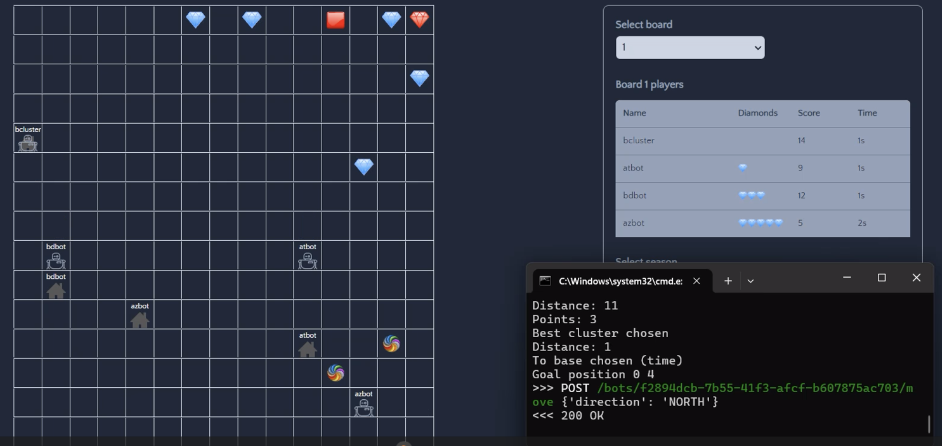

<div align="center">

# Tugas Besar 1 IF2211 Strategi Algoritma <br/> Semester II tahun 2023/2024 <br/> 
## Pemanfaatan Algoritma Greedy dalam pembuatan bot permainan Diamonds

This repository contains code for a starter bot for diamond's game. The bot is made for Algorithm Strategies task.

## Authors 

<table style="width:100%; background-color:#87CEFA; color:#F0F8FF;">
  <tr>
    <th>Nama</th>
    <th>NIM</th>
  </tr>
  <tr>
    <td>Angelica Kiera Ninta Gurning</td>
    <td>13522048</td>
  </tr>
  <tr>
    <td>Marzuli Suhada M</td>
    <td>13522070</td>
  </tr>
  <tr>
    <td>Muhammad Neo Cicero Koda</td>
    <td>13522108</td>
  </tr>
</table>

</div>

## General Information

Diamonds is a programming challenge that pits the bot you create against bots from other players. Each player will have a bot whose objective is to collect as many diamonds as possible. More about the game and game rules can be read here: [Programming Challenge](https://github.com/Etimo/diamonds2/blob/main/RULES.md).
The bot is coded with Python programming language and relies on Greedy Algorithm to select bot's action on each tick.

## Screenshot


## Program Requirements

- [Node.js](https://nodejs.org/en) 
- [Docker desktop](https://www.docker.com/products/docker-desktop/) 
- Yarn 
    ```bash
    npm install --global yarn
    ```
- Python

## How to build and compile 
To run the game engine, follow these steps:
1. Download the game engine starter pack in the form of a .zip file from the following link: [Game Engine Starter Pack v1.1.0](https://github.com/haziqam/tubes1-IF2211-game-engine/releases/tag/v1.1.0).
2. After installation, extract the .zip file and navigate to the root folder of the extracted files. Open a terminal in this directory.
3. Run the following command in the terminal to navigate to the root directory of the game engine:
    ```bash
    cd tubes1-IF2110-game-engine-1.1.0
    ```
4. Install the dependencies using yarn:
    ```bash
    yarn
    ```
5. Set up environment variables by running the following script <br/>
    For Windows:
    ```bash
    ./scripts/copy-env.bat
    ```
    For Linux / (possibly) macOS:
    ```bash
    chmod +x ./scripts/copy-env.sh
    ./scripts/copy-env.sh
    ```
6. Set up the local database by opening Docker Desktop and running the following command in the terminal:
    ```bash
    docker compose up -d database
    ```
7. Run the following script: <br/>
    For Windows:
    ```bash
    ./scripts/setup-db-prisma.bat
    ```
    For Linux / (possibly) macOS:
    ```bash
    chmod +x ./scripts/setup-db-prisma.sh
    ./scripts/setup-db-prisma.sh
    ```
8. Execute the following command to build the frontend of the game engine:
    ```bash
    npm run build
    ```
9. Start the game engine:
    ```bash
    npm run start
    ```

## How to run game engine
1. Download the kit with the .zip extension from the following link: [Bot Starter Pack v1.0.1](https://github.com/haziqam/tubes1-IF2211-bot-starter-pack/releases/tag/v1.0.1).
2. After downloading, extract the zip file. Navigate to the extracted folder using a terminal.
3. Run the following command in the terminal to navigate to the root directory of the project:
    ```bash
    cd tubes1-IF2110-bot-starter-pack-1.0.1
    ```
4. Install dependencies using pip:
    ```bash
    pip install -r requirements.txt
    ```
5. Run the program by executing the following command. Customize the logic, email, name, password, and team according to your preferences:
    ```bash
    python main.py --logic HighestDensity --email=your_email@example.com --name=your_name --password=your_password --team etimo
    ```
6. Alternatively, you can run one or multiple bots using .bat or .sh scripts. 
    For Windows:
    ```bash
    ./run-bots.bat
    ```
    For Linux / (possibly) macOS:
    ```bash
    ./run-bots.sh
    ```

## Implemented Algorithm
The implemented greedy strategy, combines "Greedy by Considering Diamond Cluster" with "Greedy by Considering Ratio - Distance Base." The bot's key actions include returning to base when the inventory is full, prioritizing areas near the base with the most diamonds when the inventory is nearly full, and selecting positions with the highest diamond ratio in optimal areas. In the absence of suitable diamond areas, if a "Red Button" is nearby, the bot will press it. The bot's movements consider the use of the "Teleporter" based on distance, opting for it when closer. If the game time is running out, the bot will head back to the base, irrespective of the diamonds in its inventory, ensuring a streamlined and effective gameplay strategy.